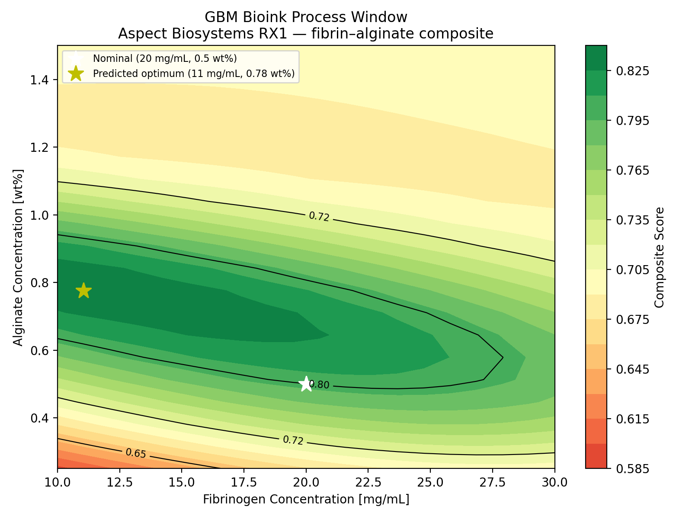
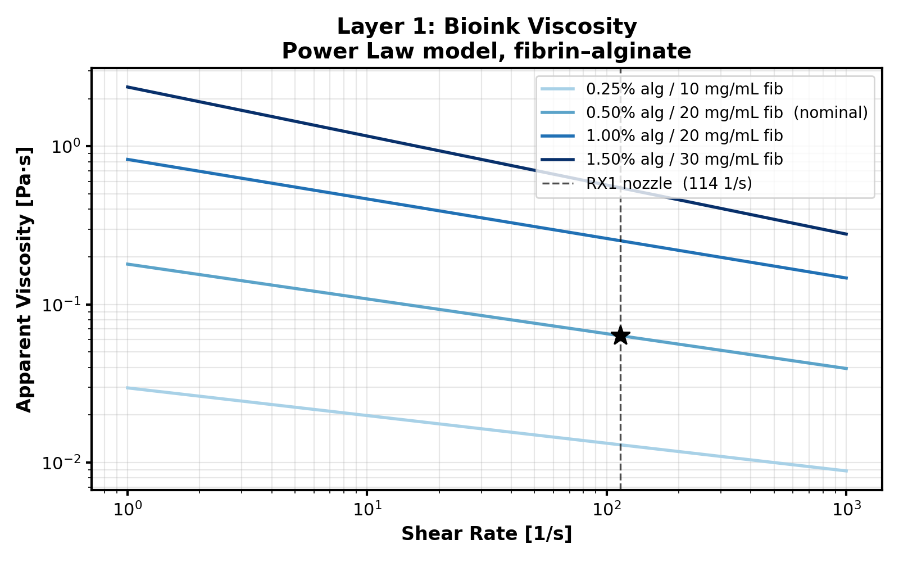
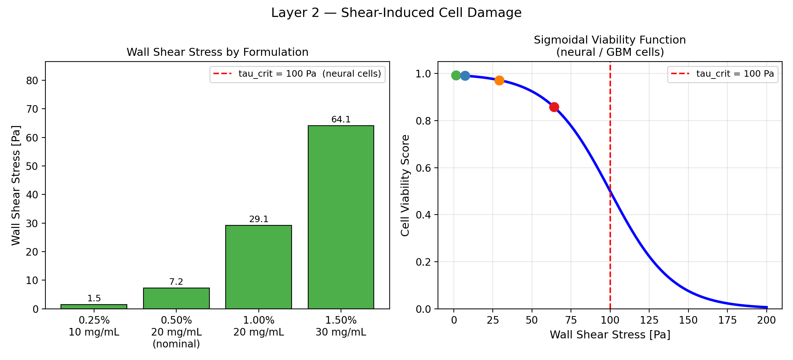
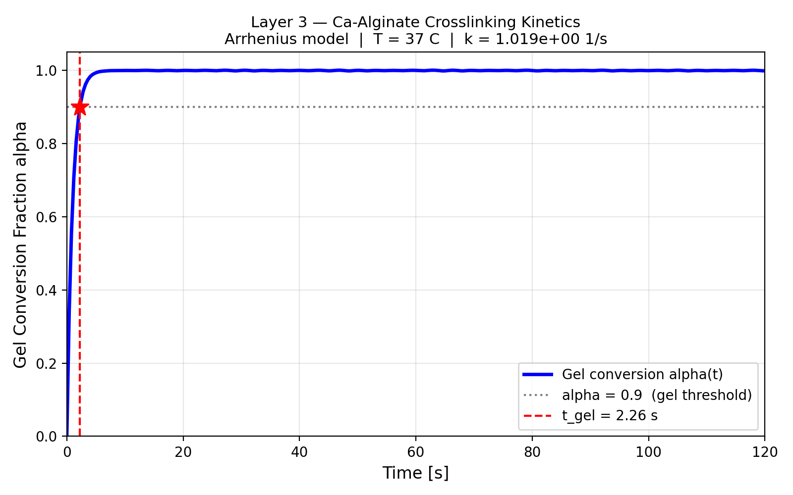
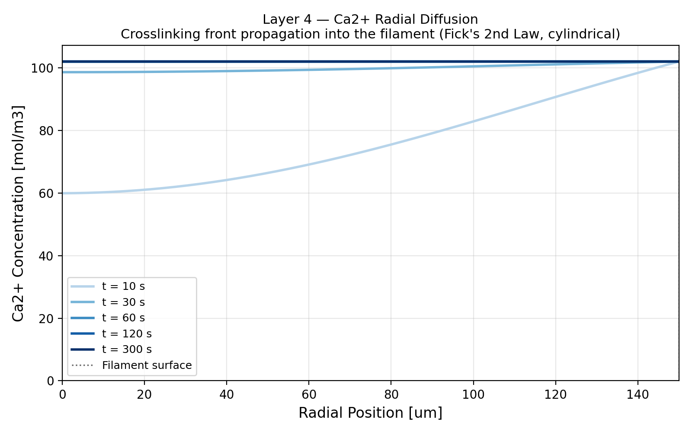
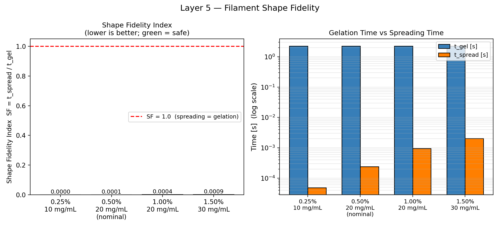
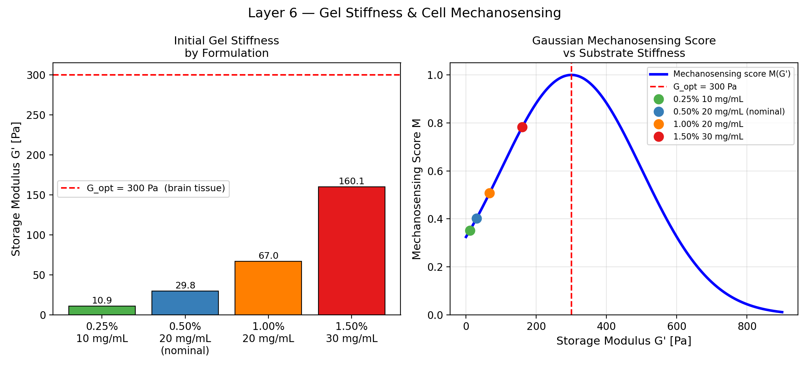
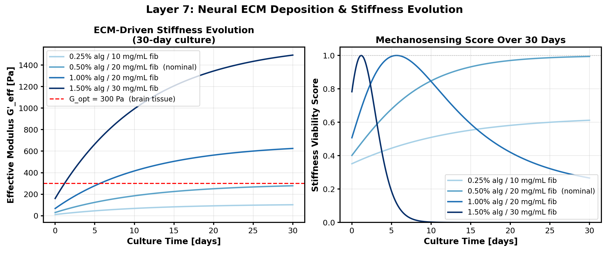
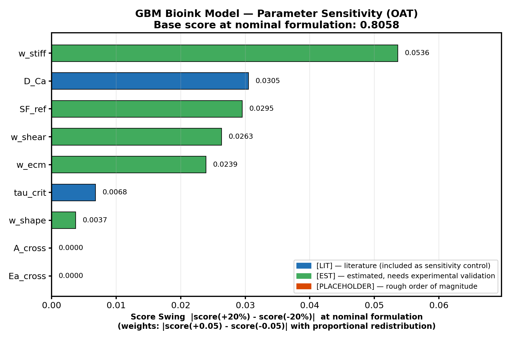

# Glioblastoma Bioink Formulation Optimization Model

I created a computational model that predicts whether a fibrin–alginate bioink formulation will successfully print a 3D glioblastoma (GBM) tumor model based on the published Aspect Biosystems ink formulation (Lee et al. 2019). 3D printed tissues make it possible for treatments to be clinically tested without animal subjects, and more accurately replicate the mechanical and structural environment of real tumors than 2D cell cultures.

---

## Background

Glioblastoma multiforme (GBM) is the most aggressive primary brain cancer, with a median survival of 14.6 months following diagnosis (Stupp et al. 2005).

The current standard treatment consists of surgical resection followed by concurrent radiotherapy and temozolomide chemotherapy (Stupp et al. 2005). This procedure has remained largely unchanged since 2005. The limited progress is partially due to the difficulty of predicting drug response. In a 2D plate, GBM cells are far more responsive to chemotherapeutics than they are in patients. The mechanical stiffness of the brain extracellular matrix (~200–500 Pa) (Budday et al. 2017) and the 3D structure of the tumor are not captured by a flat culture dish.

3D bioprinted tumor models are capable of more predictive drug screening and testing. Lee et al. (2019) demonstrated that GBM cells printed in a fibrin–alginate matrix using the Aspect Biosystems RX1 printer exhibited significantly higher TMZ resistance than the same cells on a 2D plate.

---

## The Process Window



*The white star marks the published Aspect Biosystems operating point (20 mg/mL fibrinogen, 0.5% alginate, Lee et al. 2019). The yellow star marks the model-predicted optimum (11 mg/mL fibrinogen, 0.78% alginate).*

The process window is a heatmap of composite scores across 400 formulations (20×20 grid: fibrinogen 10–30 mg/mL × alginate 0.25–1.5%). Each score is a weighted sum of four sub-scores: shear-induced cell viability, filament shape fidelity, initial gel stiffness match to brain tissue, and long-term ECM stiffness after 30 days of culture.

Only ~20% of the formulation space scores above 0.8, a narrow high-performance band. The published Aspect operating point sits inside it (score 0.80), confirming it as a strong formulation. The model predicts a slightly different optimum at **11 mg/mL fibrinogen, 0.78% alginate** (score 0.84), where higher alginate concentration improves shape retention without meaningfully degrading ECM maturation. This is a testable hypothesis, not a claim that the published formulation is wrong, but a suggestion of where to look next.

---

## What the Model Does

Finding a printable, cell-compatible formulation currently requires iterative bench experiments. This model screens 400 formulations in seconds by chaining 7 physical sub-models, each grounded in peer-reviewed literature.

Seven physical layers are solved in sequence for each formulation point:

```
Formulation (c_alg, c_fib)
        │
        ▼
Layer 1 — Viscosity          Power Law model → apparent viscosity at nozzle shear rate
        │
        ▼
Layer 2 — Shear Stress       Wall shear stress vs τ_crit = 100 Pa (neural cell damage)
        │
        ▼
Layer 3 — Crosslinking       Arrhenius kinetics → gelation time t_gel
        │
        ▼
Layer 4 — Ca²⁺ Diffusion     Fick's 2nd Law (cylindrical) → crosslinking front propagation
        │
        ▼
Layer 5 — Shape Fidelity     φ = t_spread / t_gel → does filament hold shape before gelling?
        │
        ▼
Layer 6 — Gel Stiffness      G'(c_alg, c_fib) vs G'_opt = 300 Pa (brain tissue target)
        │
        ▼
Layer 7 — ECM Deposition     First-order ODE → G'_eff evolution over 30-day culture
        │
        ▼
Composite Score (0–1) → Process Window Map
```

---

## Key Result

The process window identifies the printable, biocompatible formulation space across:
- **Fibrinogen**: 10–30 mg/mL
- **Alginate**: 0.25–1.5% w/v

The published Aspect/UBC operating point (Lee et al. 2019) falls within the high-scoring region, providing direct validation against real experimental data.

The model predicts a composite score of 0.84 at **11 mg/mL fibrinogen, 0.78% alginate**, which is slightly higher than the published nominal point (score 0.80). The difference is driven by shape integrity. A higher alginate concentration increases ink viscosity, giving the filament more resistance to surface-tension-driven spreading before gelation occurs. The nominal formulation trades some shape score for less shear stress on the cells during extrusion due to a lower fibrinogen concentration. Both formulations sit within the high-scoring region, with the model suggesting that slightly increasing the alginate and reducing the fibrinogen could improve printability without compromising cell survival or ECM maturation.

### Nominal formulation checks

| Parameter | Value | Target | Status |
|---|---|---|---|
| G' (initial gel stiffness) | 29.8 Pa | ~30 Pa (Budday et al. 2017) | ✓ |
| Wall shear stress | 7.3 Pa | < 100 Pa τ_crit (Nair et al. 2009) | ✓ |
| G'_eff at 30 days | 278 Pa | ~300 Pa (Budday et al. 2017) | ✓ |
| t_gel | 2.3 s | < t_spread | ✓ |

---

## Layer Figures

| Layer | Figure |
|---|---|
| L1: Viscosity |  |
| | |
| L2: Shear Stress |  |
| L3: Kinetics |  |
| L4: Ca²⁺ Diffusion |  |
| L5: Shape Fidelity |  |
| L6: Stiffness |  |
| L7: ECM Evolution |  |

---

## Model Sensitivity



*Tornado chart: each bar is the swing in composite score at the nominal formulation (20 mg/mL fibrinogen, 0.5 wt% alginate) when the parameter is varied ±20% (weights shifted ±0.05). Larger swing = greater influence on model predictions.*

A one-at-a-time (OAT) sensitivity analysis was run over nine uncertain parameters. The composite score at the nominal formulation point was recorded at +20% and -20% from each parameter's nominal value; the swing |score(+20%) − score(−20%)| ranks their influence.

The model is most sensitive to `w_stiff` (swing = 0.054), the weight assigned to the initial stiffness sub-score, followed by `D_Ca` (swing = 0.031) and `SF_ref` (swing = 0.030). Because the freshly printed gel starts far from the G'_opt = 300 Pa brain-tissue target (~30 Pa), the stiffness sub-score is the lowest-scoring term in the composite — so its weight has an outsized lever on the total. `D_Ca` matters because it sets the diffusion-limited gelation time (`t_gel = R²/2D`) that governs shape fidelity across the entire formulation space. `tau_crit` is a confirmed low-sensitivity control: the nominal wall shear stress (7.3 Pa) is far below the 100 Pa threshold, so even a ±20% shift is inconsequential. `Ea_cross` and `A_cross` show exactly zero sensitivity, confirming that the model is firmly diffusion-limited (Da >> 1) and Arrhenius kinetics do not affect the composite score.

**Experimental validation priority** (highest-swing [EST]/[PLACEHOLDER] parameters first):

| Parameter | Swing | Tag | Why it matters |
|---|---|---|---|
| `w_stiff` | 0.054 | [EST] | Highest single-parameter influence — derive all weights from a DOE or cell-biology ranking |
| `D_Ca` | 0.031 | [LIT] | Moderate sensitivity; validate with pulsed-field-gradient NMR at your exact alginate concentration |
| `SF_ref` | 0.030 | [EST] | Calibrate once rheology data fixes the SF range for your printer/ink |
| `w_shear`, `w_ecm` | 0.026, 0.024 | [EST] | Secondary weight sensitivity — include in the same DOE as `w_stiff` |
| `Ea_cross`, `A_cross` | 0.000 | [EST]/[PLACEHOLDER] | Zero sensitivity — safe to deprioritise for publication |

---

## How to Run

```bash
git clone https://github.com/bhwu-1/bioink-model.git
cd bioink_model
pip install -r requirements.txt
python main.py                   # all layers + process window
python main.py --sensitivity     # also runs OAT sensitivity analysis
python sensitivity.py            # sensitivity analysis standalone
```

All figures are saved to `figures/` at 200 dpi.

---

## File Structure

```
bioink_model/
├── parameters.py          All physical constants (literature-sourced, GBM-tuned)
├── layer1_viscosity.py    Power Law viscosity model
├── layer2_shear.py        Shear-induced cell damage
├── layer3_kinetics.py     Ca-alginate crosslinking kinetics (Arrhenius)
├── layer4_diffusion.py    Ca²⁺ radial diffusion (Fick's 2nd Law, cylindrical)
├── layer5_shape.py        Filament shape fidelity index
├── layer6_stiffness.py    Gel modulus and mechanosensing score
├── layer7_ecm.py          Neural ECM deposition and stiffness evolution
├── process_window.py      2D formulation sweep and composite score map
├── sensitivity.py         OAT parameter sensitivity analysis + tornado plot
├── main.py                Entry point
├── figures/               All output figures (200 dpi)
└── requirements.txt
```

---

## Key Parameters

| Parameter | Value | Source |
|---|---|---|
| Fibrinogen (nominal) | 20 mg/mL | Lee et al. 2019 |
| Alginate (nominal) | 0.5% w/v | Lee et al. 2019 |
| Genipin | 0.3 mg/mL | Lee et al. 2019 |
| Nozzle diameter | 300 µm | Aspect Biosystems RX1 |
| Print speed | 4 mm/s | Aspect Biosystems RX1 |
| τ_crit (neural) | 100 Pa | Nair et al. 2009 |
| G'_opt (brain) | 300 Pa | Budday et al. 2017 |
| D_Ca (open gel) | 5×10⁻¹⁰ m²/s | Mørch et al. 2006 |
| Culture period | 30 days | Lee et al. 2019 |

---

## References

1. Lee, J. et al. (2019). 3D bioprinting of human GBM tumor model. *Bioprinting*, 16, e00053.
2. Abelseth, E. et al. (2019). 3D printing of neural tissues from human pluripotent stem cells. *ACS Biomater. Sci. Eng.*, 5(1), 234–244.
3. Budday, S. et al. (2017). Mechanical characterization of human brain tissue. *Acta Biomaterialia*, 48, 319–340.
4. Nair, K. et al. (2009). Characterization of cell viability during bioprinting. *Biotechnol. Bioeng.*, 101(6), 1257–1266.
5. Mørch, Y.A. et al. (2006). Effect of Ca²⁺, Ba²⁺, and Sr²⁺ on alginate microbeads. *Biomacromolecules*, 7(5), 1471–1480.
6. Draget, K.I. et al. (2004). Alginates from algae. *Food Hydrocolloids*, 18(2), 213–228.
7. Ryan, E.A. et al. (1999). Structural origins of fibrin clot rheology. *Biophys. J.*, 77(5), 2813–2826.
8. Sundararaghavan, H.G. et al. (2008). Genipin-induced changes in collagen gels. *Biotechnol. Bioeng.*, 102(2), 632–643.
9. Stupp, R. et al. (2005). Radiotherapy plus concomitant and adjuvant temozolomide for glioblastoma. *N. Engl. J. Med.*, 352(10), 987–996.

---

*Ben Wu · UBC Chemical & Biological Engineering · June 2026*
